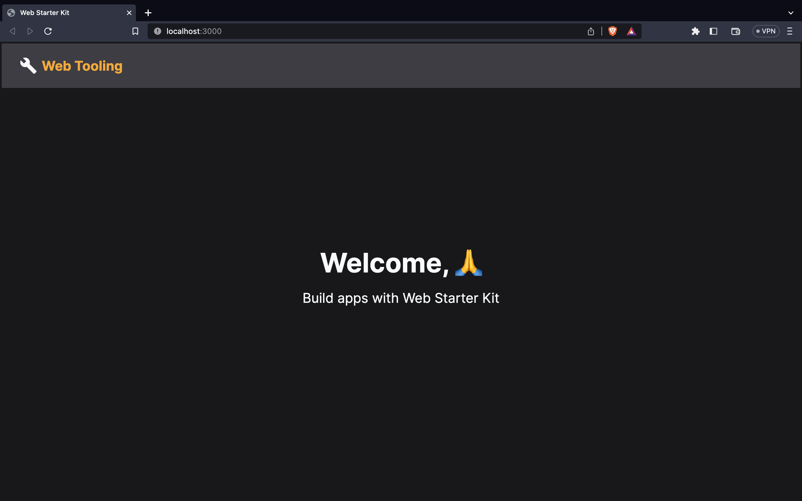

# Web Starter Kit

Configured code bundler to be used in the next web project.

## 🧰 Tools used

- Webpack
- Esbuild-loader
  (to transpile jsx, js, tsx, ts files)
- Support
  - CSS Modules
  - Declarative file path
  - Dev Server
  - Minify CSS

## 💼 Actionable

Let's make this starter kit ready to be used in the next project

- Any improvement you can think of, 🤔?
  - Raise an issue
- Star ⭐️ the repo
- Clone 🔗 and use it

## 👀

